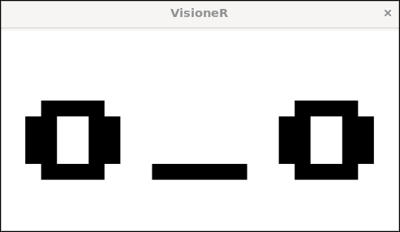

# VisioneR

[](https://github.com/an-dr/abcmake)

An app, showing different facial expressions in response for different objects in front of the camera



The project architecture is described [here](doc/architecture.md).

## Implementation

You can generate a Doxygen documentation by running the following command in the project root directory:

```bash
doxygen Doxyfile
```

Prerequisites:

- [Doxygen](http://www.doxygen.nl/)
- [Graphviz](https://graphviz.gitlab.io/download/)
