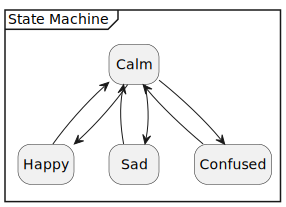

# Architecture

## SPA Introduction

This document is written using [Small Project Architecture (SPA)](https://github.com/an-dr/spa) framework. A framework that keeps the quality high and the project fun.

Friendly Reminder:

> A good architecture makes the system easy to change, in all the ways that it must change, by leaving options open.
> *Robert C. Martin, Clean Architecture*

## 1. Project Description

VisioneR is a small image recognition application. It has not practical application, but can be used as an starting point for more complex projects. The application shows an image representing a calm facial expression. The application takes images of different objects from several folders:

- good
- bad
- confusing
  
The used provides their image of a scene with different objects. The app recognizes objects on the scene and depending on the source folder shows the appropriate emotion.

## 2. Target Users

- Developers learning image recognition
- Me, reusing the code in the next projects

## 3. Use Cases

How the project will be used by the users?

## 4. Key Architecture Decisions and Principles

- The programming language is C++
- Dev tools - VSCode + CMake
- The application is aimed to work on Linux devices
- Besides this document, all the documentation is done in the source code, as the code is the most important part of the project

## 5. System

### 5.1 Documentation Structure

The documentation consists of this document and the [in-code documentation](src)

### 5.2 Testing Strategy

The project is supposed to be tested by usage.

### 5.3 Hardware Components / Deployment

### 5.4 Software Structure

### 5.5 System Conditions

### 5.6 Operational Logic

