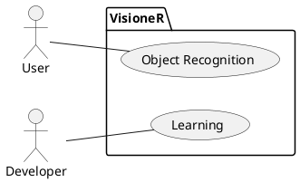
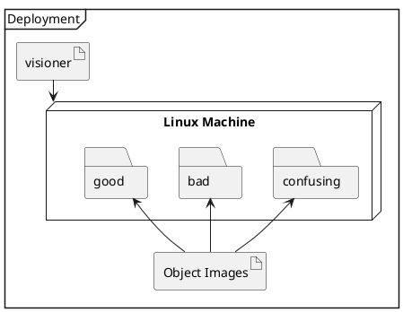
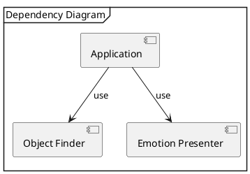
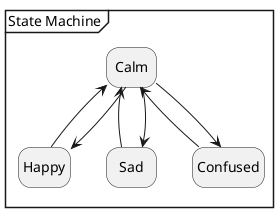

```plantuml
@startuml Use Case
left to right direction
actor User as u
actor Developer as dev

package VisioneR {
    usecase "Object Recognition" as uc1
    usecase "Learning" as uc2
}

u -- uc1
dev -- uc2

@enduml
```

```plantuml
@startuml
mainframe Deployment

' left to right direction
artifact visioner as v
artifact "Object Images" as imgs
node "Linux Machine" as pc {
    folder good as g_dir
    folder bad as b_dir
    folder confusing as c_dir
    
}

imgs -u-> g_dir
imgs -u-> b_dir
imgs -u-> c_dir
v -d-> pc

@enduml
```

```plantuml
@startuml
mainframe Dependency Diagram

[Object Finder] as find
[Application] as app
[Emotion Presenter] as emo

app --> find : use
app --> emo : use

@enduml
```

```plantuml
@startuml
hide empty description
mainframe State Machine

state Calm
state Happy
state Sad
state Confused

Calm --> Happy
Calm <-- Happy

Calm --> Sad
Calm <-- Sad

Calm --> Confused
Calm <-- Confused

@enduml
```
